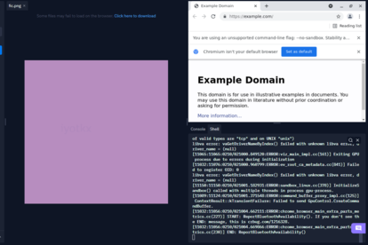

# imglink
A format that lets you open a URL from a randomly generated image. Pretty useless and just made for fun.

# NOTE
imglink is currently in early developement, and images often aren't read correctly as the image is pixelated and works best on images with smoother text.

# Usage
These are instructions for running in Replit. For setup on desktop, visit [here.](https://github.com/Unzor/imglink)
First, create a Nix REPL and clone this project in Replit using Git (command: `git clone https://github.com/Unzor/imglink -b replit`).
Then, run `cd imglink && bash set_up_enviroment.sh`.
Then, install all dependencies by running:
```
npm install
```
Generate image (example):
```
node generate "https://example.com" out.png
```

Image generated:


Read image (example):
```
node read out.png
```

Result (clone this branch in Replit to run):


